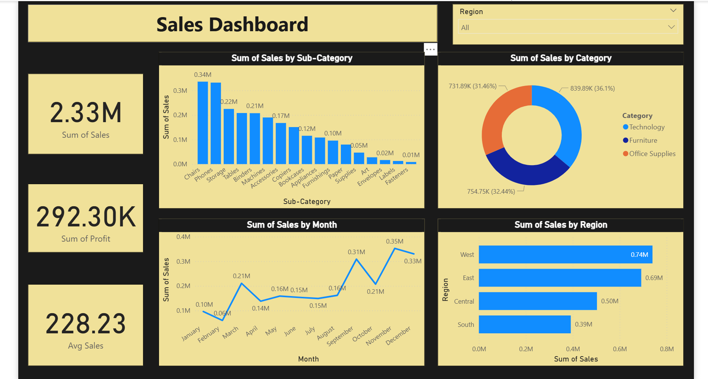

# Sales Performance Analysis Dashboard using Power BI & SQL

## 📌 Project Overview
This project focuses on analyzing business sales data to extract meaningful insights and support better decision-making.  
Using **SQL** for data extraction and **Power BI** for visualization, an interactive **Sales Performance Dashboard** was created to understand trends in sales, profit, product performance, and regional demand.

---

## 🎯 Objectives
- Analyze total sales and profit performance
- Identify best and worst-performing product categories and sub-categories
- Understand monthly and regional sales trends
- Help stakeholders make data-driven decisions

---

## 🛠️ Tools & Technologies Used
| Tool / Technology | Purpose |
|------------------|---------|
| **SQL** | Data extraction, filtering, and preparation |
| **Power BI** | Dashboard design & visualization |
| **Excel / CSV Data** | Base data source |

---

## 📊 Dashboard Preview

---

## 🔍 Key Insights
- **Total Sales:** ~2.33M indicating strong business revenue
- **Total Profit:** ~292K showing healthy margins
- **Top Product Categories:** *Technology* contributes the highest share
- **Top Sub-Categories:** Chairs and Phones lead in performance
- **Monthly Trend:** Sales peak during **October to December**
- **Best Region:** **West** region shows the highest revenue

---

## 🧠 What This Dashboard Helps With
- Identifying **high-value products**
- Understanding **seasonal demand trends**
- Planning **regional sales strategies**
- Improving **inventory and marketing decisions**

---

## 📂 Project Structure
